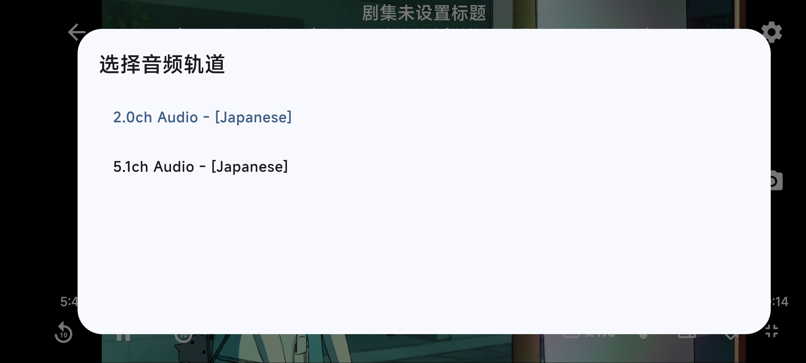
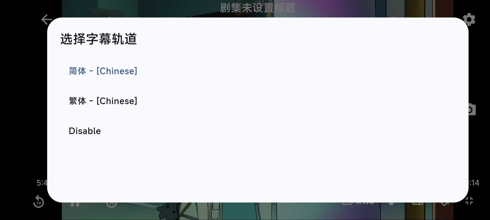
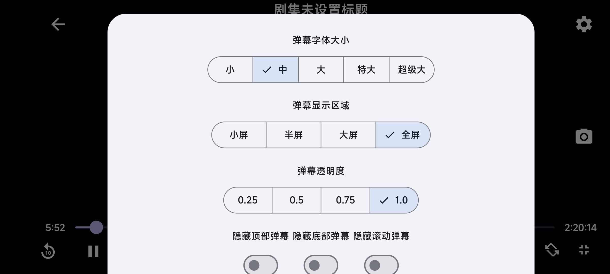

# ikaros_app

ikaros app by flutter


# Json generate

```
flutter packages pub run build_runner build
```

## 核心版本适配情况
请根据ikaros server版本(core版本)，选择合适的插件版本下载，

核心版本适配情况如下：
- 插件版本1.x.x 到 现在：需要core版本大于1.0.4

# Build

`Android Studio`最新版是JBR21，版本太高，
建议去[Android Studio Archives](https://developer.android.google.cn/studio/archive)下载老版本的，
推荐版本：`Android Studio Jellyfish | 2023.3.1 April 30, 2024`，

git 子模块初始化：
```
git submodule init
git submodule update

cd dependencies/dart_vlc
flutter pub get

cd ../../
cd dependencies/flutter_vlc_player
flutter pub get

cd ../../
cd dependencies/ns_danmaku
flutter pub get


cd ../../
flutter pub get
```
用`Android Studio`打开后，如果依赖里还有红线的，进对应的目录，`flutter pub get`下就OK了。


# 环境

```text
flutter doctor -v
```

<details>
  <summary>环境详细信息</summary>

```text
[✓] Flutter (Channel stable, 3.24.5, on Microsoft Windows [版本 10.0.22631.4460], locale zh-CN)
    • Flutter version 3.24.5 on channel stable at C:\Applications\flutter\3.24.5
    • Upstream repository https://github.com/flutter/flutter.git
    • Framework revision dec2ee5c1f (15 hours ago), 2024-11-13 11:13:06 -0800
    • Engine revision a18df97ca5
    • Dart version 3.5.4
    • DevTools version 2.37.3

[✓] Windows Version (Installed version of Windows is version 10 or higher)

[✓] Android toolchain - develop for Android devices (Android SDK version 35.0.0)
    • Android SDK at C:\Users\chivehao\AppData\Local\Android\Sdk
    • Platform android-35, build-tools 35.0.0
    • ANDROID_HOME = C:\Users\chivehao\AppData\Local\Android\Sdk
    • Java binary at: C:\Applications\android\android-studio\jbr\bin\java
    • Java version OpenJDK Runtime Environment (build 17.0.10+0--11572160)
    • All Android licenses accepted.

[✓] Chrome - develop for the web
    • Chrome at C:\Users\chivehao\AppData\Local\Google\Chrome\Application\chrome.exe

[✓] Visual Studio - develop Windows apps (Visual Studio Community 2022 17.11.5)
    • Visual Studio at C:\Program Files\Microsoft Visual Studio\2022\Community
    • Visual Studio Community 2022 version 17.11.35327.3
    • Windows 10 SDK version 10.0.22621.0

[✓] Android Studio (version 2023.3)
    • Android Studio at C:\Applications\android\android-studio
    • Flutter plugin can be installed from:
      🔨 https://plugins.jetbrains.com/plugin/9212-flutter
    • Dart plugin can be installed from:
      🔨 https://plugins.jetbrains.com/plugin/6351-dart
    • Java version OpenJDK Runtime Environment (build 17.0.10+0--11572160)

[✓] IntelliJ IDEA Community Edition (version 2024.3)
    • IntelliJ at C:\Program Files\JetBrains\IntelliJ IDEA Community Edition 2024.3
    • Flutter plugin can be installed from:
      🔨 https://plugins.jetbrains.com/plugin/9212-flutter
    • Dart plugin can be installed from:
      🔨 https://plugins.jetbrains.com/plugin/6351-dart

[✓] VS Code (version 1.94.2)
    • VS Code at C:\Users\chivehao\AppData\Local\Programs\Microsoft VS Code
    • Flutter extension can be installed from:
      🔨 https://marketplace.visualstudio.com/items?itemName=Dart-Code.flutter

[✓] Connected device (4 available)
    • sdk gphone64 x86 64 (mobile) • emulator-5554 • android-x64    • Android 15 (API 35) (emulator)
    • Windows (desktop)            • windows       • windows-x64    • Microsoft Windows [版本 10.0.22631.4460]
    • Chrome (web)                 • chrome        • web-javascript • Google Chrome 131.0.6778.69
    • Edge (web)                   • edge          • web-javascript • Microsoft Edge 126.0.2592.61

[✓] Network resources
    • All expected network resources are available.

• No issues found!
```


</details>

# 截图

### 条目收藏页和条目列表页

|  |  | 
|:--------------------------------------------------------------------------:|:-------------------------------------------------------------------------:|


### 我的页和历史纪录页

|  |  | 
|:--------------------------------------------------------------------------:|:-------------------------------------------------------------------------:|

### 条目高级搜索和条目全局搜索

|  |  | 
|:--------------------------------------------------------------------------:|:-------------------------------------------------------------------------:|

### 条目详情介绍和条目详情信息

|  |  | 
|:--------------------------------------------------------------------------:|:-------------------------------------------------------------------------:|

### 条目剧集播放

|  |  | 
|:--------------------------------------------------------------------------:|:-------------------------------------------------------------------------:|

### 剧情视频音轨选择、字幕轨道选择、弹幕配置

|  |  |  |
|:--------------------------------------------------------------------------:|:-------------------------------------------------------------------------:|:-------------------------------------------------------------------------:|

